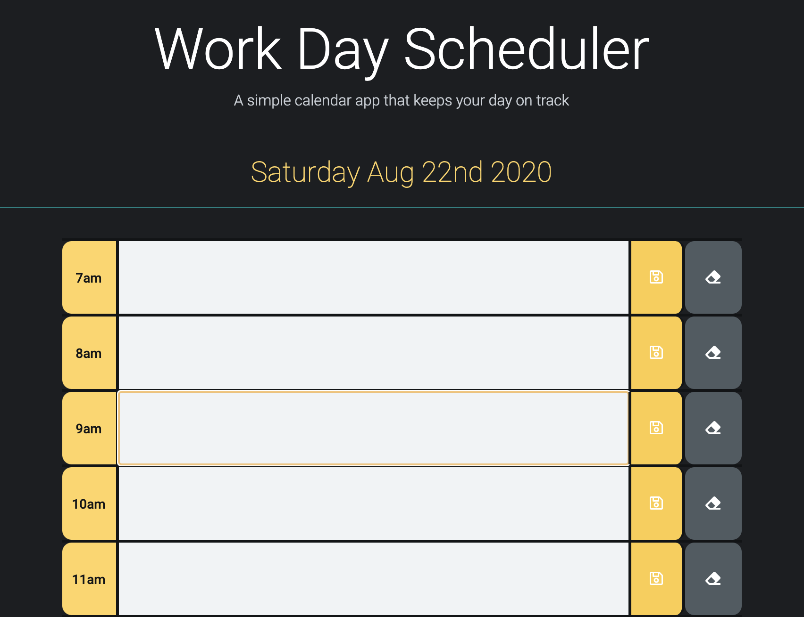

# hw-5-planner
A simple calendar application that allows users to save events for each hour of the day.
  
### __Daily Planner__
Set up a planner that will allow the user to pick a time, add in content and save. The calendar will let you know the past, present and future times which will be differentiated by color. 
  
Even when the user leaves the page, their saved content in each calendar row will remain saved inside the interface with the help of local storage. 
  

### __Goals and Impressions__

The goal is to create a working calendar with the following features:

* Create an attractive User Interface
* Allow users to type in and save content
* Store content in local storage
* Pull content from local storage and back into interface when refresh or close of browser occurs

 
This was a challenging experience, but the outcome was really awesome, and I would love to explore ways to make a more robust app.
  

### __Example__
 

 

### __View Project__
[Calendar](https://ashhunt07.github.io/hw-5-planner/) - view it now!
[GitHub](https://github.com/ashhunt07/hw-5-planner)

 

##### Sources
##### Original JavaScript & CSS by Ashley Hunt 